a       # Spring Boot REST-ful Service Day 1

## 1. Create a Simple REST-ful Service
Develop a Spring Boot REST API that returns the response: **"Welcome to Spring Boot"**

- 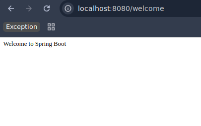
## 2. Create an Employee Bean
Define an `Employee` model with fields: `id`, `name`, and `age`.
- 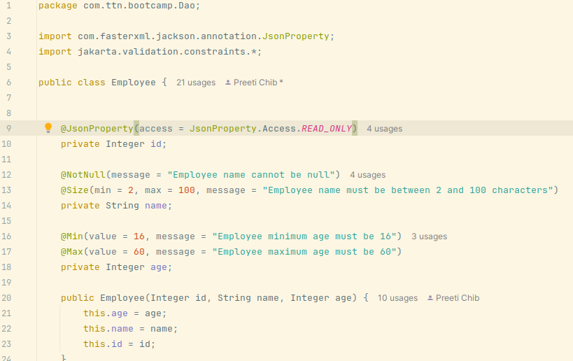
## 3. Implement GET Request to Retrieve All Employees
Develop a service to fetch a list of employees.
- 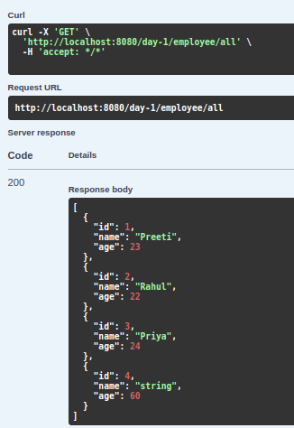
## 4. Implement GET Request with Path Variable to Retrieve One Employee
Fetch an employee by their ID.
- 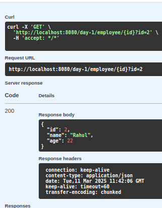
## 5. Implement POST Request to Create a New Employee
Create a new employee entry.
- 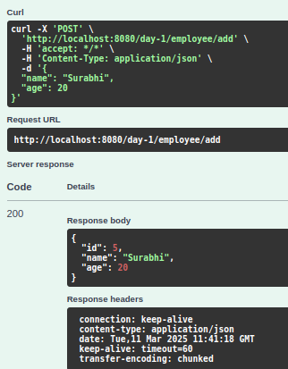
## 6. Implement Exception Handling for Resource Not Found
- 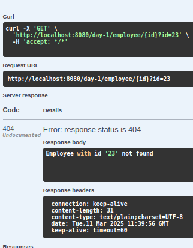
## 7. Implement DELETE Request to Delete an Employee
- 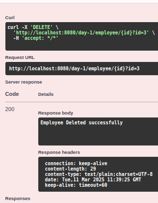
## 8. Implement PUT Request to Update an Employee
- 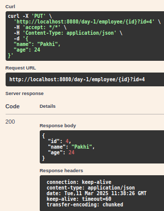
## 9. Apply Validation While Creating a New Employee Using POST Request
- 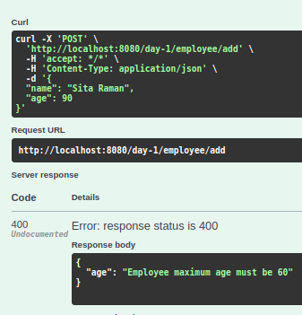
## 10. Configure Actuator in Your Project
Configure actuator to check the health of the application and get information about various beans configured in your application.  
- 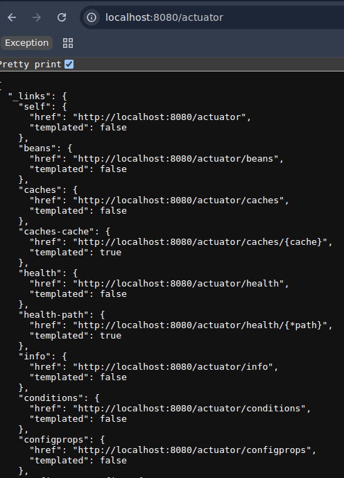
- 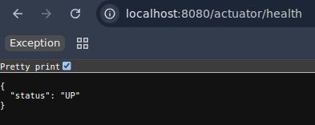
- !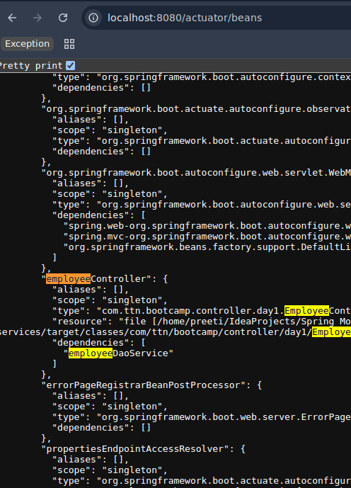