# Spring Boot RESTful Service - Day 2

## 1. Internationalization
### A) Add support for Internationalization
- Configure the application to support messages in **English (default), German, and Swedish**.

### B) Create a GET Request for Localized Greeting
- Implement a GET request that takes `"username"` as a parameter and returns a localized message:  
  **"Hello, Username"** (using message properties).
- 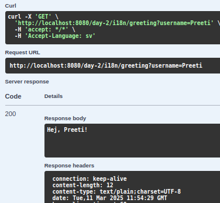

## 2. Content Negotiation
### A) Create a POST Method for User Creation
- Implement a POST method that **accepts XML** input to create user details.
- 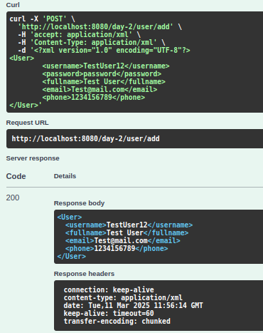

### B) Create a GET Method to Fetch Users in XML
- Implement a GET method that **returns the list of users in XML format**.
- 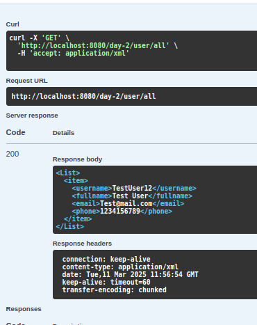

## 3. Swagger Configuration
### A) Configure Swagger and Document APIs
- Configure the **Swagger plugin** and generate API documentation for the following methods:
    - **GET**: Fetch user details
    - **POST**: Save user details
    - **DELETE**: Remove a user
  
- 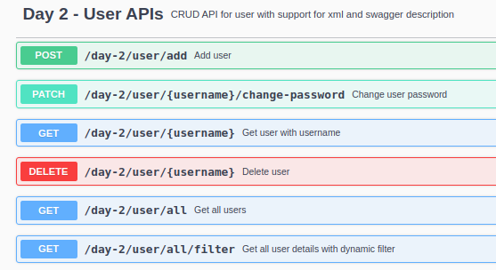

### B) Enhance Swagger Documentation
- Add **descriptions** for each class and URI to clarify their purpose in Swagger UI.
- 

## 4. Static and Dynamic Filtering
### A) Static Filtering
- Create an API that **saves user details (including password)** but returns only **non-sensitive data** in the response.

- 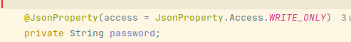

### B) Dynamic Filtering
- Implement another API that does the **same filtering dynamically** based on conditions.
- 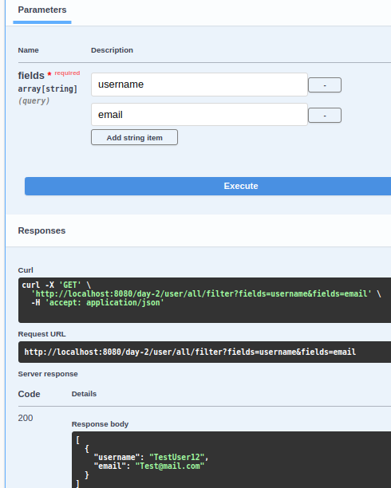

## 5. Versioning RESTful APIs
- Create **two APIs** to return user details:
    - One returns **basic user details**.
    - Another returns **enhanced user details**.

### Apply API Versioning Using:
A) **MimeType Versioning**  
- 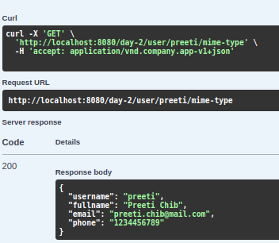
- 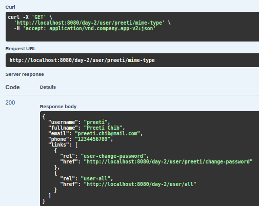

---
B) **Request Parameter Versioning**
- 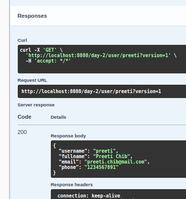
- 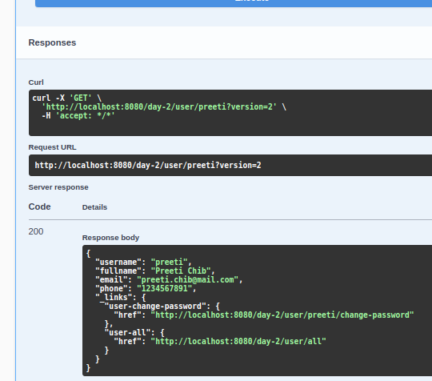
---
C) **URI Versioning**  
- 
- 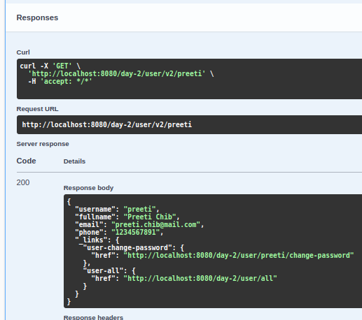
---
D) **Custom Header Versioning**
- 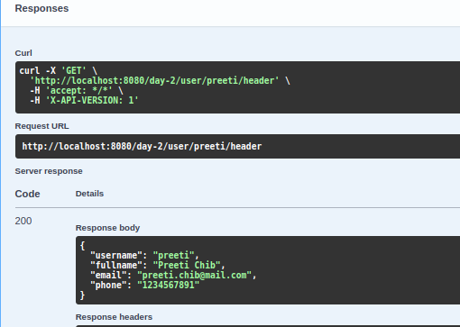
- 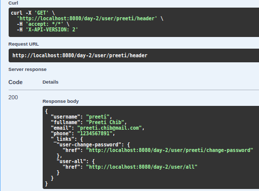
---
## 6. HATEOAS
### A) Configure HATEOAS in Spring Boot
- Implement an API that **returns user details along with links** to show all topics dynamically.  
- 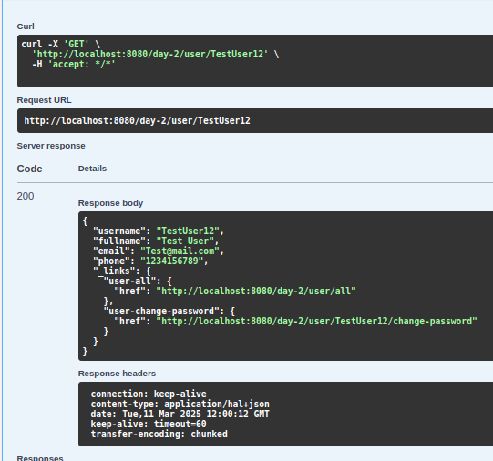